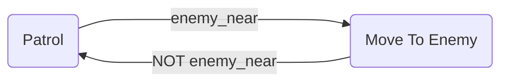
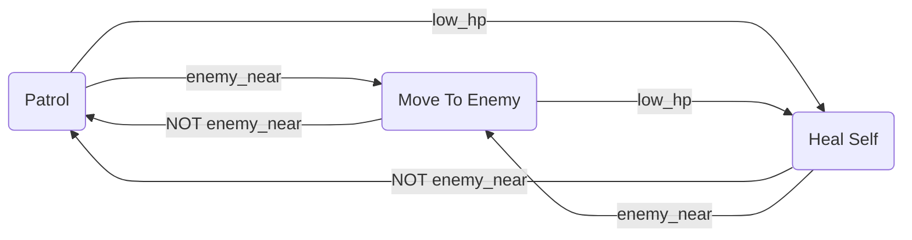
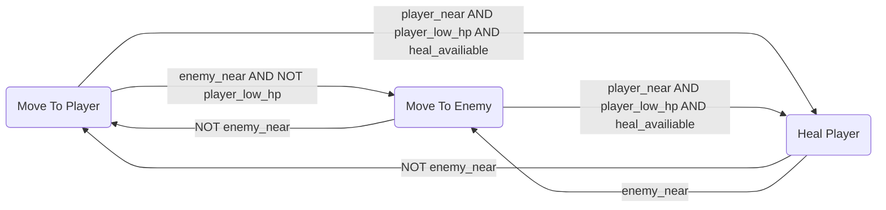

## Монстр-берсерк

```mermaid
flowchart LR
    A(Patrol) ---->|enemy_near| B(Move To Enemy)
    B ---->|NOT enemy_near| A
```

## Монстр-хилер

```mermaid
graph LR
    A(Patrol) ---->|enemy_near| B(Move To Enemy)
    B ---->|NOT enemy_near| A

    A ---->|low_hp| C(Heal Self)
    B ---->|low_hp| C

    C ---->|NOT enemy_near| A
    C ---->|enemy_near| B
```

## Мечник-хилер

```mermaid
graph LR
    A(Move To Player) ---->|enemy_near AND NOT player_low_hp| B(Move To Enemy)
    B ---->|NOT enemy_near| A

    A ---->|player_near AND player_low_hp AND heal_availiable| C(Heal Player)
    B ---->|player_near AND player_low_hp AND heal_availiable| C

    C ---->|NOT enemy_near| A
    C ---->|enemy_near| B
```
